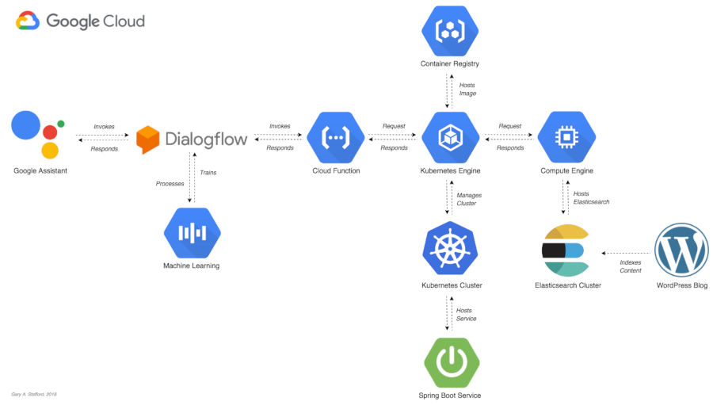

# Programmatic Ponderings Search Action for Google Assistant

This project was created for the post, [Integrating Search Capabilities with Actions for Google Assistant, using GKE and Elasticsearch](https://programmaticponderings.com/). This two-part post explores the enhancement of voice and text-based conversational interfaces by integrating a search and analytics engine. By interfacing an Action for Google Assistant conversational interface with Elasticsearch, we will improve the Action’s ability to provide relevant results to the end-user.

This repository contains the Action's serverless Cloud Function, detailed in the post, which communicates with Elasticsearch, via the [Spring Boot Service](https://github.com/garystafford/spring-wp-search).

## Google Assistant Preview

Here is a brief [YouTube video preview](https://www.youtube.com/watch?v=k7TIv2NAIrc) of the final Action for Google Assistant, we will explore in this post, running on an Apple iPhone 8.

## Architecture

The final architecture of the Action for Google Assistant will look as follows.

